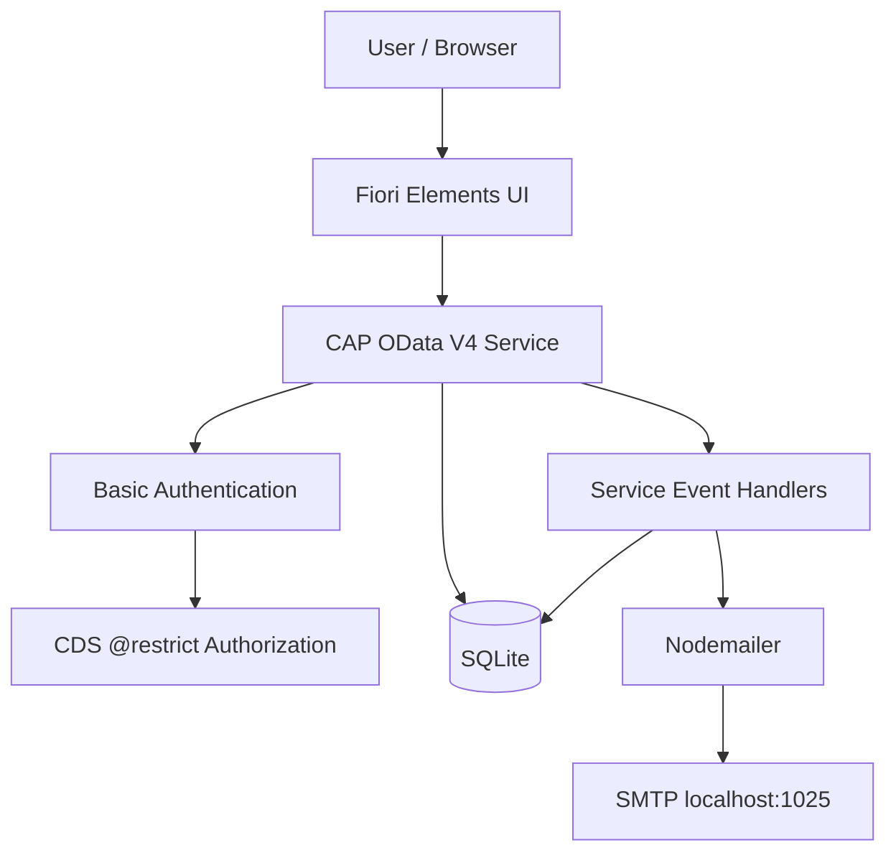
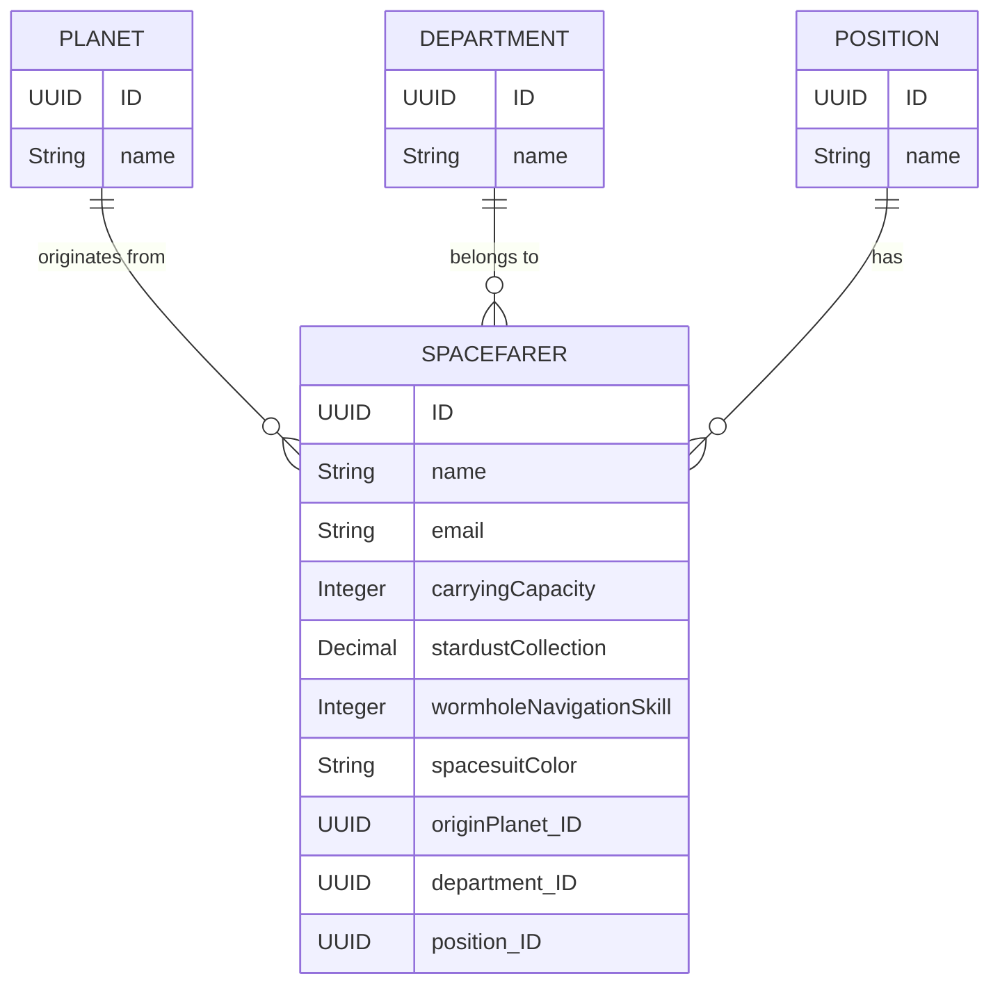
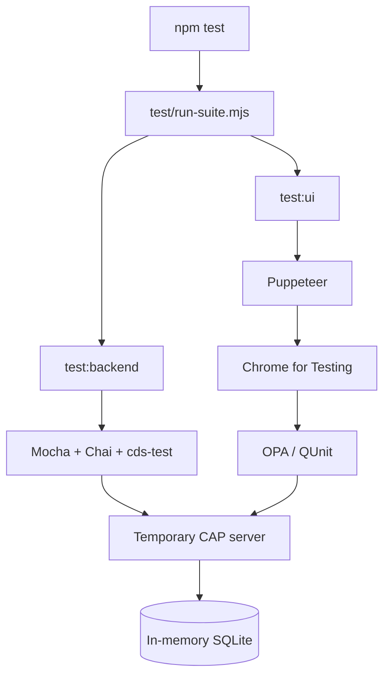

# Galactic Spacefarer 🚀

A full-stack SAP Cloud Application Programming Model (CAP) application with an SAP Fiori Elements UI for managing galactic **Spacefarers**.

The project was created as a technical assessment solution for the **Galactic Spacefarer Adventure** exercise. It combines a CDS data model, an OData V4 service, CAP authorization, server-side business rules, draft-enabled Fiori Elements pages, custom UI behavior for pagination and signed-in user information, automated backend tests, and end-to-end OPA UI tests executed in a real browser.

The implementation is intentionally focused on the assessment requirements while keeping security-sensitive rules on the backend and presentation-specific behavior in the UI.

---

## Table of Contents

1. [Project Overview](#project-overview)
2. [Assessment Requirements](#assessment-requirements)
3. [Implemented Features](#implemented-features)
4. [Technology Stack](#technology-stack)
5. [Architecture](#architecture)
6. [Project Structure](#project-structure)
7. [Data Model](#data-model)
8. [Service Definition](#service-definition)
9. [Authentication and Authorization](#authentication-and-authorization)
10. [Planet-based Data Isolation](#planet-based-data-isolation)
11. [Business Rules](#business-rules)
12. [Create Flow and Event Handlers](#create-flow-and-event-handlers)
13. [Update Flow](#update-flow)
14. [Fiori Elements Application](#fiori-elements-application)
15. [List Report](#list-report)
16. [Pagination](#pagination)
17. [Signed-in User Information](#signed-in-user-information)
18. [Object Page](#object-page)
19. [Origin Planet Read-only Rule](#origin-planet-read-only-rule)
20. [Draft Handling](#draft-handling)
21. [Local Database and Seed Data](#local-database-and-seed-data)
22. [Email Handling](#email-handling)
23. [Testing](#testing)
24. [Test Architecture](#test-architecture)
25. [Test Coverage](#test-coverage)
26. [OData API](#odata-api)
27. [Validation Rules](#validation-rules)
28. [Installation](#installation)
29. [Configuration](#configuration)
30. [Running the Application](#running-the-application)
31. [Running the Tests](#running-the-tests)
32. [Puppeteer and Chrome for Testing](#puppeteer-and-chrome-for-testing)
33. [Troubleshooting](#troubleshooting)
34. [Development and Git Workflow](#development-and-git-workflow)
35. [Design Decisions](#design-decisions)
36. [Assignment Coverage](#assignment-coverage)
37. [Known Scope Decisions](#known-scope-decisions)
38. [Repository](#repository)
39. [Author](#author)
40. [Final Verification Checklist](#final-verification-checklist)

---

## Project Overview

**Galactic Spacefarer** is a Node.js-based SAP CAP application backed by SQLite for local development and exposing an **OData V4** service consumed by an **SAP Fiori Elements** application.

The main domain object is `Spacefarer`. Every Spacefarer has an origin planet, department, position, personal/contact data, and several cosmic attributes:

- stardust collection
- wormhole navigation skill
- carrying capacity
- spacesuit color
- origin planet
- intergalactic department
- position
- email address

The application has two deliberately separated local users:

- **Han Solo** — Corellia
- **Ellen Ripley** — Earth

A central requirement of the application is that a signed-in user must only be able to access Spacefarers originating from the user's own planet. This restriction is enforced by CAP authorization rules and reinforced by explicit service-level checks for create/update operations.

The Fiori Elements frontend provides a List Report and Object Page. The List Report includes filtering, sorting, deterministic numbered pagination, and signed-in user information. The Object Page supports editing the fields required by the assessment while preventing the origin planet from being changed.

---

## Assessment Requirements

The technical assessment asks for a **Galactic Spacefarer Adventure** application built with SAP CAP and Fiori Elements.

The original requirements can be summarized as follows:

### Task 1 — Spacefarer Data Model

Create a Spacefarer data model containing at least:

- stardust collection
- wormhole navigation skill
- origin planet
- spacesuit color
- relationships with departments
- relationships with positions

### Task 2 — Cosmic Service Definition

Create a CAP service with CRUD operations and protect it from unauthorized access.

### Task 3 — Cosmic Event Handlers

Use CAP `@Before` and `@After` handlers when a new Spacefarer is created:

- `@Before` — validate and enhance the candidate's business data
- `@After` — send a congratulatory notification email after successful creation

### Task 4 — Galactic List Report

Create a Fiori Elements List Report displaying Spacefarers and supporting:

- sorting
- filtering
- pagination

The list must show at least stardust collection and spacesuit color.

### Task 5 — Galactic Object Page

Create an Object Page showing detailed information for a selected Spacefarer and allowing relevant cosmic information to be edited, including:

- stardust collection
- spacesuit color

### Additional requirements

The assessment also specifies:

- SQLite for local development
- authenticated users only
- planet-level data isolation
- optional use of SAP Fiori Tools / Application Modeler
- a GitHub repository for the project

The implementation below covers these requirements and adds automated backend and UI verification around the important behavior.

---

## Implemented Features

### Backend

- SAP CAP service implemented with CDS and JavaScript
- OData V4 service
- CRUD support for Spacefarers
- Fiori draft-enabled Spacefarer entity
- Basic Authentication for local development
- planet-based authorization using CDS `@restrict`
- cross-planet read isolation
- cross-planet create protection
- cross-planet update protection
- cross-planet delete protection through authorization
- server-side input validation
- server-side stardust calculation during CREATE
- `@Before CREATE` handler
- `@Before UPDATE` handler
- `@After CREATE` handler
- congratulatory email notification after successful creation/activation
- controlled mail failure behavior
- SQLite persistence for local development

### Fiori Elements UI

- Fiori Elements List Report
- Fiori Elements Object Page
- OData V4 model
- server-side table operation
- sorting
- filtering
- deterministic numbered pagination
- Previous / Next pagination controls
- direct numbered page navigation
- current page result count
- total matching result count
- signed-in user information
- signed-in user's planet
- create flow
- edit and save flow
- carrying capacity range guidance (`1–10`)
- wormhole navigation skill range guidance (`1–5`)
- origin planet shown as read-only during editing

### Automated testing

- CAP service integration tests
- CDS/OData metadata verification
- CRUD tests
- authentication tests
- planet isolation tests
- CREATE validation tests
- UPDATE validation tests
- draft-aware CREATE and UPDATE flows
- email success/failure tests
- OPA/QUnit UI tests
- Puppeteer browser execution
- automatic Chrome for Testing bootstrap
- unified test runner
- sectioned terminal reporting
- non-zero exit code on failed tests

---

## Technology Stack

| Area | Technology |
|---|---|
| Application framework | SAP Cloud Application Programming Model (CAP) |
| Runtime | Node.js |
| Backend language | JavaScript (ES modules) |
| Domain modelling | CDS |
| API | OData V4 |
| Database | SQLite |
| Frontend | SAP Fiori Elements |
| UI framework | SAPUI5 |
| UI architecture | List Report + Object Page |
| Authentication | CAP Basic Authentication |
| Authorization | CAP `@restrict` + service-level checks |
| Draft support | CAP / Fiori draft handling |
| Email | Nodemailer |
| Local SMTP target | `localhost:1025` |
| Backend testing | Mocha + Chai + `@cap-js/cds-test` |
| Async assertions | `chai-as-promised` |
| UI testing | OPA5 + QUnit |
| Browser automation | Puppeteer |
| Browser | Chrome for Testing |
| Package manager | npm |
| Version control | Git / GitHub |

### Main package versions

The project is built around the following relevant package lines:

```text
@sap/cds        ^10
@cap-js/sqlite  ^3.1.1
cds-plugin-ui5  ^0.17.0
nodemailer      ^10.0.15
@cap-js/cds-test ^1.0.2
mocha           ^12.0.3
chai            ^6.3.0
chai-as-promised ^8.0.2
puppeteer       ^25.12.0
```

The frontend application uses the SAPUI5 / UI5 tooling required by the generated Fiori Elements application.

---

## Architecture

The project uses a standard layered CAP architecture with a Fiori Elements frontend and a test layer around the backend and browser UI.



### Request processing model

A normal authenticated request follows this conceptual flow:

```text
Browser
  ↓
Fiori Elements
  ↓
OData V4
  ↓
Authentication
  ↓
Planet-based authorization
  ↓
Service handlers / CAP generic processing
  ↓
SQLite
  ↓
OData response
  ↓
Fiori Elements
```

For CREATE, the handler layer also participates in preparing and validating the incoming entity. For successful creation, the `@After` handler sends the notification email.

---

## Project Structure

The important project structure is:

```text
galactic-spacefarer/
├── .vscode/
│   ├── extensions.json
│   ├── launch.json
│   └── tasks.json
├── app/
│   └── spacefarers/
│       ├── .appGenInfo.json
│       ├── annotations.cds
│       ├── package.json
│       ├── ui5.yaml
│       └── webapp/
│           ├── ext/
│           │   ├── controller/
│           │   │   ├── SpacefarersList.controller.js
│           │   │   └── SpacefarerObjectPage.controller.js
│           │   └── fragment/
│           │       ├── SpacesuitColorField.fragment.xml
│           │       ├── SpacesuitColorFilter.fragment.xml
│           │       └── StardustCollectionField.fragment.xml
│           ├── i18n/
│           │   ├── i18n.properties
│           │   └── i18n_en.properties
│           ├── test/
│           │   └── integration/
│           │       ├── IsolationJourney.js
│           │       ├── ListReportJourney.js
│           │       ├── ObjectPageJourney.js
│           │       ├── SpacefarersListJourney.gen.js
│           │       ├── opaTests.qunit.html
│           │       ├── opaTests.qunit.js
│           │       └── pages/
│           │           ├── JourneyRunner.js
│           │           ├── SpacefarersList.gen.js
│           │           ├── SpacefarersList.js
│           │           └── SpacefarersObjectPage.js
│           ├── Component.js
│           ├── index.html
│           └── manifest.json
│
├── db/
│   ├── data/
│   │   ├── galactic.spacefarer-Departments.csv
│   │   ├── galactic.spacefarer-Planets.csv
│   │   ├── galactic.spacefarer-Positions.csv
│   │   └── galactic.spacefarer-Spacefarers.csv
│   └── schema.cds
│
├── srv/
│   ├── spacefarer-service.cds
│   └── spacefarer-service.js
│
├── scripts/
│   └── ensure-chrome.mjs
│
├── test/
│   ├── backend/
│   │   ├── 01-data-model-service.test.js
│   │   ├── 02-authorization.test.js
│   │   ├── 03-create-validation.test.js
│   │   ├── 04-update-validation.test.js
│   │   ├── 05-email-after-create.test.js
│   │   └── _hooks.js
│   ├── helpers/
│   │   ├── auth.js
│   │   ├── cds-app.js
│   │   ├── draft.js
│   │   ├── fixtures.js
│   │   ├── mail.js
│   │   └── reporter.js
│   ├── ui/
│   │   └── run-opa.mjs
│   └── run-suite.mjs
│
├── .cdsrc.json
├── .gitignore
├── .puppeteerrc.cjs
├── eslint.config.mjs
├── package-lock.json
├── package.json
└── README.md
```

### Main responsibilities

| File / area | Responsibility |
|---|---|
| `db/schema.cds` | Persistent CDS domain model |
| `srv/spacefarer-service.cds` | Service exposure and authorization annotations |
| `srv/spacefarer-service.js` | Custom service behavior and business validation |
| `app/spacefarers/annotations.cds` | Fiori Elements UI annotations |
| `app/spacefarers/webapp/manifest.json` | Fiori application descriptor and routing/template configuration |
| `app/spacefarers/webapp/Component.js` | UI bootstrap and authenticated user context |
| `app/spacefarers/webapp/ext/controller/SpacefarersList.controller.js` | Custom List Report pagination and related UI behavior |
| `app/spacefarers/webapp/ext/controller/SpacefarerObjectPage.controller.js` | Object Page custom behavior |
| `test/backend/*` | Backend test groups |
| `test/ui/*` | Browser/UI test runner |
| `test/helpers/*` | Shared testing utilities |
| `scripts/ensure-chrome.mjs` | Ensures Puppeteer's Chrome for Testing is available |

Generated SAP UI tooling files are treated as generated artifacts and are not manually modified unless explicitly required by the application.

---

## Data Model

The persistent model is defined in `db/schema.cds`.



### `Planets`

Reference entity representing a Spacefarer's origin planet.

Main fields:

```text
ID
name
spacefarers (association to many Spacefarers)
```

### `Departments`

Reference entity representing an intergalactic department.

Main fields:

```text
ID
name
spacefarers (association to many Spacefarers)
```

### `Positions`

Reference entity representing a Spacefarer's position.

Main fields:

```text
ID
name
spacefarers (association to many Spacefarers)
```

### `Spacefarers`

Main domain entity.

```text
ID
createdAt / createdBy
modifiedAt / modifiedBy
name
email
originPlanet
department
position
carryingCapacity
stardustCollection
wormholeNavigationSkill
spacesuitColor
```

The project also defines a `SpacesuitColor` enum with the following values:

```text
BLACK
WHITE
BLUE
RED
GREEN
```

### Managed fields

`Spacefarers` uses CAP's `managed` aspect, therefore the standard managed fields are available for created/modified timestamps and users.

### Relationships

Each Spacefarer references exactly one:

- origin planet
- department
- position

These reference relationships are also represented in the Fiori Elements UI using expanded association properties and value helps.

---

## Service Definition

The service is defined in:

```text
srv/spacefarer-service.cds
```

The service is protected with:

```cds
service SpacefarerService @(requires: 'authenticated-user')
```

The service exposes:

```text
Spacefarers
Planets
Departments
Positions
getCurrentUser()
```

The `Spacefarers` projection is draft-enabled for the Fiori Elements edit flow.

The service also marks the origin planet as immutable at the service projection level:

```cds
annotate SpacefarerService.Spacefarers with {
  originPlanet @immutable;
}
```

The frontend additionally renders the origin planet as read-only during editing so that users cannot initiate an invalid planet change from the Object Page. The UPDATE handler independently rejects attempts to change it to another planet.

---

## Authentication and Authorization

Security is implemented as **defense in depth**.

### Authentication

The service requires an authenticated user:

```cds
@(requires: 'authenticated-user')
```

For local development, CAP's Basic Authentication strategy is configured through `.cdsrc.json`.

### Authorization

The `Spacefarers` entity uses a planet-aware `@restrict` rule conceptually equivalent to:

```text
READ / CREATE / UPDATE / DELETE
        ↓
authenticated-user
        ↓
originPlanet.name = $user.planet
```

This means a user's planet is part of the authorization decision.

### Two local identities

| Username | Password | User | Planet |
|---|---|---|---|
| `han` | `han` | Han Solo | Corellia |
| `ellen` | `ellen` | Ellen Ripley | Earth |

These credentials are local test credentials only and must not be treated as production credentials.

---

## Planet-based Data Isolation

Planet isolation is one of the most important business/security requirements of the application.

The rule is simple:

```text
User can only see and manage Spacefarers
whose origin planet matches the user's planet.
```

### Han Solo

```text
User:   Han Solo
Planet: Corellia

Visible data:
  Corellia Spacefarers only
```

### Ellen Ripley

```text
User:   Ellen Ripley
Planet: Earth

Visible data:
  Earth Spacefarers only
```

### Direct URL protection

The isolation is not implemented as a UI-only filter.

A user cannot bypass the restriction simply by manually addressing another Spacefarer's OData URL. The backend authorization layer applies the same isolation rule to direct entity reads.

### Cross-planet mutations

The service also validates origin planet information during CREATE and UPDATE.

Therefore a user cannot:

- create a Spacefarer for another planet
- change a Spacefarer's origin planet to another planet
- use the Fiori draft flow to bypass the planet restriction
- mutate another planet's record through a direct OData request

These scenarios are explicitly tested by the backend test suite.

---

## Business Rules

### Stardust calculation

For CREATE operations, stardust is calculated from carrying capacity and wormhole navigation skill:

```text
stardustCollection = carryingCapacity × skillMultiplier
```

The skill multiplier is:

| Wormhole Navigation Skill | Multiplier |
|---:|---:|
| 1 | 0.5 |
| 2 | 1.0 |
| 3 | 1.5 |
| 4 | 2.0 |
| 5 | 2.5 |

Examples:

```text
10 × 0.5 = 5.0
5  × 2.0 = 10.0
7  × 2.5 = 17.5
```

### Important CREATE vs UPDATE distinction

The implementation intentionally treats CREATE and UPDATE differently because the assessment requires editing stardust on the Object Page.

**CREATE:**

- carrying capacity is validated
- wormhole navigation skill is validated
- stardust is calculated by the backend

**UPDATE:**

- the fields required by the Object Page can be edited
- stardust may be edited as an application field, as required by Task 5
- the CREATE-only stardust calculation is not blindly reapplied to every update
- email format is validated when supplied
- origin planet changes are protected

This distinction is also reflected in the automated UPDATE tests.

---

## Create Flow and Event Handlers

The custom service implementation is in:

```text
srv/spacefarer-service.js
```

### `@Before CREATE`

Before creating a new Spacefarer, the service:

1. verifies that the requested origin planet belongs to the authenticated user
2. validates the email format
3. validates carrying capacity
4. validates wormhole navigation skill
5. calculates the stardust value

Conceptually:

```text
CREATE request
     ↓
@Before CREATE
     ↓
planet check
     ↓
email validation
     ↓
capacity validation
     ↓
skill validation
     ↓
stardust calculation
     ↓
persistence / draft lifecycle
```

### `@After CREATE`

After successful creation/activation, the service sends a congratulatory message to the newly created Spacefarer.

Conceptually:

```text
successful CREATE
      ↓
persistence completed
      ↓
@After CREATE
      ↓
Nodemailer
      ↓
local SMTP
```

### Failure behavior

If validation fails before activation, the Spacefarer is not considered successfully created and the congratulatory email is not sent.

If mail delivery itself fails after the service reaches the notification stage, the handler reports the failure with a server error rather than silently treating the operation as successful.

---

## Update Flow

The Fiori Elements Object Page uses CAP draft handling.

A typical edit flow is:

```text
Active Spacefarer
      ↓
draftEdit
      ↓
PATCH draft
      ↓
draftActivate
      ↓
active Spacefarer updated
```

The service's UPDATE handler protects the origin planet and validates email data when it is supplied.

The backend authorization rules remain active during the draft lifecycle, so Fiori draft handling does not create a separate security path.

---

## Fiori Elements Application

The frontend is a SAP Fiori Elements application based on the standard:

- `sap.fe.templates.ListReport`
- `sap.fe.templates.ObjectPage`

The OData V4 service used by the application is:

```text
/odata/v4/spacefarer/
```

The default model is configured for server-oriented operation.

The application uses annotations for the majority of the standard Fiori rendering and adds custom controllers/extensions only for behavior that is application-specific.

---

## List Report

The List Report is the main entry point of the application.

It displays the Spacefarer list with information such as:

- name
- email
- origin planet
- department
- position
- carrying capacity
- stardust collection
- wormhole navigation skill
- spacesuit color

### Sorting

The List Report supports sorting through Fiori Elements table functionality. The annotated default presentation is name ascending.

### Filtering

The UI provides selection fields for the relevant Spacefarer properties, including:

- name
- email
- origin planet
- department
- position
- stardust collection
- spacesuit color

Filtering is applied against the service while the user's planet authorization remains enforced by the backend.

### Table behavior

The application deliberately uses a **fixed-size, numbered pagination model** rather than infinite scrolling, growing lists, or a "More" action.

This makes the result deterministic and easy to verify in automated UI tests.

---

## Pagination

Pagination is one of the custom UI parts of the project.

### Configuration

```text
Page size: 15
```

The List Report displays classic numbered page navigation:

```text
[Previous] [1] [2] [3] ... [Next]
```

Only the available page numbers are displayed around the active page according to the pagination controller's navigation logic.

### Seed-data example

Each test planet contains 17 Spacefarers, therefore:

```text
Page 1 → 15 records
Page 2 → 2 records
```

The table title is updated to make both values visible:

```text
Spacefarers (15 of 17)
```

and on page 2:

```text
Spacefarers (2 of 17)
```

After filtering, the same mechanism works with the **matching filtered result count**, not with the unfiltered global total.

### Navigation

The UI supports:

- Previous
- Next
- direct page-number navigation
- current-page tracking
- automatic reloading when the binding/filter state changes
- consistent table/title updates

### Implementation note

The pagination logic is intentionally kept in the existing `SpacefarersList.controller.js` implementation because it is a working, tested custom integration with the generated Fiori Elements table.

It is not refactored into a second pagination framework or replaced with a generic custom table implementation.

---

## Signed-in User Information

The List Report header displays the currently authenticated user's identity and planet.

For Han:

```text
Signed in as: Han Solo
Planet: Corellia
```

For Ellen:

```text
Signed in as: Ellen Ripley
Planet: Earth
```

The backend exposes:

```text
getCurrentUser()
```

The response contains the user ID, display name, and planet information used by the frontend.

The user information is therefore not hardcoded as a static text value in the List Report.

The frontend keeps the signed-in state in a JSON model and uses the backend-provided identity information for the header.

---

## Object Page

Selecting a Spacefarer opens the Fiori Elements Object Page.

The Object Page presents the Spacefarer's detailed information using semantic sections/facets such as:

- identity
- assignment
- cosmic profile

The UI annotations define the displayed sections and fields.

### Editable fields

The assessment explicitly asks the Object Page to support editing of:

- stardust collection
- spacesuit color

The application supports these edits through the standard CAP/Fiori draft flow.

### Range guidance

The application provides user-facing labels for numeric fields:

```text
Carrying Capacity (1–10)
Wormhole Navigation Skill (1–5)
```

These labels are guidance for the user and do not replace backend validation.

---

## Origin Planet Read-only Rule

The origin planet is a security-relevant relationship because it determines which planet's data belongs to the authenticated user.

For this reason, **origin planet must not be editable on the Object Page**.

### UI behavior

During editing:

- the current origin planet remains visible
- the user cannot change it
- no alternative planet selector is offered
- the field is rendered read-only

### Backend behavior

The frontend rule is intentionally not the only protection.

The backend also:

- restricts access by the user's planet
- checks origin planet changes during UPDATE
- rejects attempts to move a Spacefarer to another planet

This is defense in depth:

```text
Frontend
  ↓
originPlanet = read-only

Backend
  ↓
originPlanet cannot violate user's planet isolation
```

The read-only UI rule is therefore primarily a correctness and user-experience safeguard, while the backend remains the authoritative security layer.

---

## Draft Handling

The application uses `@odata.draft.enabled` on the `Spacefarers` service projection to support the Fiori Elements editing lifecycle.

### CREATE

The Fiori create flow produces a draft and then activates it.

Conceptually:

```text
POST /Spacefarers
      ↓
PATCH /Spacefarers(...,IsActiveEntity=false)
      ↓
POST /Spacefarers(...,IsActiveEntity=false)/draftActivate
```

### UPDATE

The edit flow uses:

```text
POST /Spacefarers(...,IsActiveEntity=true)/draftEdit
      ↓
PATCH /Spacefarers(...,IsActiveEntity=false)
      ↓
POST /Spacefarers(...,IsActiveEntity=false)/draftActivate
```

The backend tests intentionally exercise these draft flows rather than testing an unrealistic direct database mutation.

---

## Local Database and Seed Data

SQLite is used for local development as required by the assessment.

The seed data is loaded from CSV files in:

```text
db/data/
```

### Current test dataset

```text
Corellia: 17 Spacefarers
Earth:    17 Spacefarers
------------------------
Total:    34 Spacefarers
```

The dataset is intentionally larger than the 15-row page size.

This guarantees deterministic multi-page behavior for both supported users:

```text
17 records
→ 15 on page 1
→ 2 on page 2
```

### Seed data purpose

The seed dataset is not only demo content. It exists to provide stable test conditions for:

- pagination
- total counts
- visible page counts
- planet isolation
- different authenticated users
- Object Page navigation
- deterministic UI tests

The Earth dataset includes additional domain sample records, including **Julie Mao** and **Chris Pike**, so that Earth contains the same 17-record test volume as Corellia.

### Local test database

Backend integration tests use an isolated in-memory SQLite database so that individual test runs remain reproducible and do not depend on a developer's local persistent database state.

---

## Email Handling

The congratulatory notification is implemented with **Nodemailer**.

### Local mail target

The default local SMTP endpoint is:

```text
host: localhost
port: 1025
secure: false
```

This is compatible with a local MailHog-style SMTP setup.

### Successful flow

```text
CREATE / activation succeeds
        ↓
@After CREATE
        ↓
Nodemailer
        ↓
localhost:1025
        ↓
mail delivered to local mailbox
```

### Failed flow

```text
CREATE
  ↓
validation error
  ↓
activation rejected
  ↓
no congratulatory email
```

The automated mail tests do not require a real external mail provider. A controlled mail transport/test double is used so that the tests can verify the message without sending real messages to external recipients.

---

## Testing

The repository contains a complete test suite with backend integration tests and browser-driven OPA tests.

### One command

```bash
npm test
```

The root test command executes:

```text
backend tests
     +
OPA UI tests
     ↓
unified report
```

The suite exits with code `1` when at least one section fails.

### Last recorded full test result

The complete suite has been successfully executed and recorded with:

```text
Passed : 39
Failed : 0
Skipped: 0
Total  : 39
```

The recorded result consists of:

```text
27 backend tests
12 UI / OPA tests
-----------------
39 total tests
```

Run `npm test` again after any subsequent code change before merging the final state to `main`. The result above documents the last known full passing run; it should not be treated as a substitute for re-running the suite after a final change.

---

## Test Architecture

The testing layer is intentionally split by responsibility.



### Backend test framework

Backend tests use:

- `@cap-js/cds-test`
- Mocha
- Chai
- `chai-as-promised`

The test helpers provide common functionality for:

- authentication
- draft lifecycle calls
- mail capture
- test reporting

### UI test framework

The UI layer uses:

- OPA5
- QUnit
- Puppeteer
- Chrome for Testing

Custom page objects are used for the application-specific List Report and Object Page journeys.

Generated page objects are not manually rewritten for application behavior.

---

## Test Coverage

The unified test suite is organized into **8 logical sections**.

### 1. Data Model / Service

Verifies:

- OData metadata exposure
- `Spacefarers` availability
- reference entities (`Planets`, `Departments`, `Positions`)
- authenticated read access
- CREATE flow
- UPDATE flow
- DELETE flow

### 2. Authorization / Data Isolation

Verifies:

- no authentication → `401`
- valid Han credentials → access allowed
- valid Ellen credentials → access allowed
- Han sees Corellia Spacefarers only
- Ellen sees Earth Spacefarers only
- Han cannot directly GET an Earth Spacefarer
- cross-planet CREATE is rejected
- cross-planet UPDATE is rejected
- cross-planet DELETE is rejected

### 3. CREATE Input Validation

Verifies:

- capacity `1` accepted
- capacity `10` accepted
- capacity below `1` rejected
- capacity above `10` rejected
- non-integer capacity rejected
- skill `1` accepted
- skill `5` accepted
- skill below `1` rejected
- skill above `5` rejected
- non-integer skill rejected
- invalid email rejected
- valid origin planet accepted when it matches the user
- missing/wrong origin planet rejected
- stardust formula is applied

### 4. UPDATE Input Validation

Verifies:

- valid updates persist
- invalid email is rejected
- origin planet change is rejected
- CREATE-only capacity/skill rules are not incorrectly reused for UPDATE
- Fiori-style draft edit/activate behavior is exercised

### 5. `@After CREATE` / Email

Verifies:

- successful activation sends the expected notification
- recipient is correct
- subject/message can be asserted
- failed activation does not send a notification

### 6. List Report / Pagination / Signed-in User

The OPA journey verifies the core List Report behavior, including:

- application startup
- signed-in user information
- signed-in planet information
- Create action availability
- 15-row page size
- `15 of 17` page 1 state
- navigation to page 2
- `2 of 17` page 2 state
- Previous navigation
- numbered page navigation
- cleanup/teardown

### 7. Object Page / Edit / Labels

Verifies:

- navigation from List Report to Object Page
- detailed object view
- carrying capacity range guidance
- wormhole skill range guidance
- editable Object Page values
- saving changes
- persistence of updated values

### 8. UI Data Isolation

Starts the application as Ellen and verifies:

- Ellen is shown as the signed-in user
- Earth is shown as the current planet
- only Earth data is displayed
- the expected seeded Earth record volume is visible

---

## OData API

The service is available at:

```text
/odata/v4/spacefarer
```

### Metadata

```text
/odata/v4/spacefarer/$metadata
```

### Main entity sets

```text
/Spacefarers
/Planets
/Departments
/Positions
```

### Current-user function

```text
getCurrentUser()
```

The current-user function is used by the UI to retrieve the signed-in user's identity and planet.

### Spacefarer operations

The `Spacefarers` entity supports the standard OData operations required by the application:

```text
GET
POST
PATCH
DELETE
```

Fiori draft support adds the standard draft actions/endpoints required by the Fiori Elements lifecycle.

---

## Validation Rules

The authoritative validation is performed in the CAP service layer.

### Carrying capacity

Allowed range:

```text
1–10
```

Must be a whole number.

```text
1    ✓
10   ✓
0    ✗
11   ✗
1.5  ✗
```

### Wormhole navigation skill

Allowed range:

```text
1–5
```

Must be a whole number.

```text
1    ✓
5    ✓
0    ✗
6    ✗
2.5  ✗
```

### Email

The server validates email format using a simple email-address pattern before the record is accepted by the relevant CREATE/UPDATE handler.

Invalid values are rejected with a `400` error.

### Origin planet

The origin planet is required and is security-sensitive.

For CREATE:

```text
origin planet must match authenticated user's planet
```

For UPDATE:

```text
origin planet cannot be changed to another planet
```

The field is also presented as read-only in the Object Page edit UI.

### Stardust

During CREATE, the backend calculates stardust from carrying capacity and wormhole skill using the documented multiplier table.

During UPDATE, the Object Page permits stardust editing as required by the assessment.

---

## Installation

### Prerequisites

The project requires:

- Node.js
- npm
- Git
- network access during dependency/browser installation

A globally installed Chrome browser is **not required** for the automated UI tests.

### Clone the repository

```bash
git clone https://github.com/mate153/galactic-spacefarer.git
cd galactic-spacefarer
```

### Install dependencies

```bash
npm install
```

The project has a `postinstall` step that ensures the required Puppeteer browser binary is installed.

The project-local browser cache is stored under:

```text
.cache/puppeteer
```

and is excluded from Git.

---

## Configuration

### `.cdsrc.json`

The local CAP setup defines the development authentication users.

```text
han / han
ellen / ellen
```

Associated attributes are:

| User | Name | Planet | Email |
|---|---|---|---|
| `han` | Han Solo | Corellia | `han-solo@starwars.com` |
| `ellen` | Ellen Ripley | Earth | `ellen-ripley@alien.com` |

These are intentionally simple local credentials for the assessment environment.

### SMTP

The service uses:

```text
Host: localhost
Port: 1025
Secure: false
```

A MailHog-compatible local SMTP server can be used when manually inspecting generated emails.

### Puppeteer

The repository contains:

```text
.puppeteerrc.cjs
```

and:

```text
scripts/ensure-chrome.mjs
```

The cache path is kept project-local so UI test execution does not depend on a user's global Puppeteer cache location.

---

## Running the Application

### Start the CAP application

```bash
npm start
```

Equivalent development command:

```bash
cds watch
```

### Start the dedicated Spacefarers Fiori page

```bash
npm run watch-spacefarers
```

This command launches CAP in watch mode and opens the Spacefarers Fiori Elements page.

The application uses:

```text
/odata/v4/spacefarer/
```

as its OData service endpoint.

### Authentication

When the browser requests credentials, use one of the local test users.

For example:

```text
Username: han
Password: han
```

or:

```text
Username: ellen
Password: ellen
```

---

## Running the Tests

### Complete test suite

```bash
npm test
```

This is the recommended command before committing or opening a pull request.

### Backend only

```bash
npm run test:backend
```

### UI / OPA only

```bash
npm run test:ui
```

### Reuse an already running CAP server

The UI runner accepts:

```text
TEST_BASE_URL
```

Example:

```bash
TEST_BASE_URL=http://localhost:4004 npm run test:ui
```

### Use a different temporary test port

The UI test runner can use:

```text
TEST_PORT
```

Example:

```bash
TEST_PORT=5000 npm run test:ui
```

The default temporary port used by the UI runner is `4155`.

---

## Puppeteer and Chrome for Testing

The browser tests originally exposed a common environment problem: Puppeteer could not find the expected Chrome for Testing version because it was looking at the wrong cache location.

The project now handles this explicitly.

### Components of the solution

```text
.puppeteerrc.cjs
      ↓
project-local Puppeteer cache
      ↓
scripts/ensure-chrome.mjs
      ↓
Chrome for Testing available
      ↓
npm run test:ui
```

The package configuration includes a `postinstall` hook:

```text
node scripts/ensure-chrome.mjs
```

The UI test path also checks for the browser before execution, so the test suite can recover even when dependency installation was performed with scripts disabled.

### Git behavior

The downloaded browser cache is not committed to the repository:

```text
.cache/puppeteer
```

is ignored.

---

## Troubleshooting

### `Could not find Chrome`

Run:

```bash
npm install
```

The project should install the expected browser into the configured project-local Puppeteer cache.

If necessary, the browser can also be installed using Puppeteer's own browser-install command.

After installation, verify that the project-local cache exists:

```text
.cache/puppeteer
```

### The UI test cannot connect to CAP

By default, `test/ui/run-opa.mjs` can start a temporary CAP server for the UI suite.

Alternatively, start CAP manually and provide its URL:

```bash
TEST_BASE_URL=http://localhost:4004 npm run test:ui
```

### Port already in use

Use another temporary test port:

```bash
TEST_PORT=5000 npm run test:ui
```

### Authentication issue

Use the configured users:

```text
han / han
ellen / ellen
```

Remember that each user can only access records from their own planet.

### Mail testing issue

For manual email inspection, start a MailHog-compatible SMTP service that accepts mail on:

```text
localhost:1025
```

The automated tests themselves use a controlled mail implementation and do not require an external mail provider.

### Cross-planet data appears unexpectedly

Do not rely on the UI filter as a security mechanism.

The expected behavior is enforced by the CAP service authorization layer. If a direct API request appears to bypass the UI, verify the authenticated user's planet and the `@restrict`/service-level checks before changing frontend logic.

---

## Development and Git Workflow

The project uses feature-oriented branches and small, reviewable commits.

Recommended workflow:

```text
Create branch
     ↓
Implement one focused change
     ↓
Run relevant tests
     ↓
Run npm test
     ↓
Inspect git diff
     ↓
Commit
     ↓
Push
     ↓
Open / update Pull Request
     ↓
Merge into develop
```

### Example branches

The implementation has been organized around focused changes such as:

```text
feat/ui-pagination

test/data-seed

feature/test-suite

fix/readonly-origin-planet
```

The exact local branch names can evolve, but the principle is to isolate unrelated changes.

### Example conventional commits

```text
feat(ui): improve list report pagination and user feedback

test(data): expand seed data to 17 spacefarers per planet

test: add comprehensive backend and OPA test suite

fix(ui): make origin planet read-only
```

### Before merging

Run:

```bash
npm test
git status
git diff
git log --oneline --decorate -6
```

This keeps the final branch reviewable and makes it easier to catch unintended changes.

---

## Design Decisions

### Fiori Elements instead of a fully custom UI

The assessment explicitly asks for a List Report and Object Page. The project therefore uses SAP Fiori Elements templates and annotations as the primary UI implementation.

Custom controllers/extensions are used only for application-specific requirements such as pagination and authenticated user presentation.

### Backend authorization is authoritative

The frontend may hide or disable controls, but frontend behavior is not treated as a security boundary.

The backend is always responsible for enforcing planet isolation.

### Origin planet is immutable

The origin planet determines data ownership and therefore must not be editable by the user on the Object Page.

The implementation uses both:

- service-level immutability semantics
- a read-only frontend field

and keeps explicit backend protection for malicious/direct requests.

### CREATE-only stardust calculation

The assessment requests calculated stardust behavior when a new Spacefarer is created, while Task 5 requests editing stardust on the Object Page.

The implementation therefore calculates stardust on CREATE but does not force a recalculation on every UPDATE.

### Draft-aware integration testing

Because Fiori Elements editing uses CAP drafts, the tests intentionally exercise draft creation, draft editing, and activation rather than mocking the UI by changing database rows directly.

### Fixed numbered pagination

The application uses numbered pagination rather than an infinite or growing list because:

- the requirement explicitly calls for pagination
- it is deterministic
- it is easily testable
- the seed data can demonstrate multiple pages

### No custom logout flow

A custom logout button/page is not implemented. The assessment does not require a custom logout workflow, and the application is intentionally kept focused on the requested authentication and authorization behavior.

### No large controller refactor

The working pagination controller is intentionally left as a single focused integration point rather than introducing an unneeded framework/refactor late in the assessment.

This minimizes regression risk in an already tested custom Fiori Elements integration.

---

## Assignment Coverage

| Assessment requirement | Implementation |
|---|---|
| Spacefarer data model | `db/schema.cds` |
| Stardust collection | `Spacefarers.stardustCollection` |
| Wormhole navigation skill | `Spacefarers.wormholeNavigationSkill` |
| Origin planet | `Spacefarers.originPlanet` |
| Spacesuit color | `SpacesuitColor` enum + `spacesuitColor` |
| Department relationship | `department` association |
| Position relationship | `position` association |
| CAP service | `srv/spacefarer-service.cds` |
| CRUD operations | OData `Spacefarers` entity |
| Authentication | `@(requires: 'authenticated-user')` |
| Planet-level authorization | CDS `@restrict` + service checks |
| CREATE `@Before` handler | Validation + stardust calculation |
| CREATE `@After` handler | Congratulatory email |
| Local SQLite | `@cap-js/sqlite` |
| List Report | Fiori Elements template |
| Sorting | Fiori table/presentation annotations |
| Filtering | Fiori selection fields / table filtering |
| Pagination | Custom numbered pagination, 15 rows/page |
| Object Page | Fiori Elements Object Page |
| Editable stardust | Object Page edit flow |
| Editable spacesuit color | Object Page edit flow |
| Origin planet protection | Read-only UI + backend validation/authorization |
| User/planet information | `getCurrentUser()` + UI JSON model |
| Automated tests | Mocha/Chai/cds-test + OPA/QUnit/Puppeteer |
| GitHub repository | Public Git repository |

---

## Known Scope Decisions

These points are intentional and should not be mistaken for unfinished assessment functionality.

### Basic Authentication is local/test-oriented

The configured credentials are for local development and automated testing. A production-grade deployment would replace them with an appropriate identity provider and production identity configuration.

### SQLite is the local persistence target

The assessment explicitly asks for SQLite for local development. The project therefore does not introduce a larger external database setup just for the local solution.

### Mail delivery is local

The local SMTP endpoint is suitable for development/testing. It is not presented as a production email infrastructure.

### The UI remains Fiori Elements

The project does not replace the generated Fiori Elements architecture with a separate fully custom SAPUI5 application merely to implement the requested custom behavior.

### Origin planet is not an editable business field

Although the underlying CDS entity contains the `originPlanet` relationship, users must not be allowed to change it during editing because it is tied directly to the planet-based authorization model.

---

## Repository

GitHub repository:

```text
https://github.com/mate153/galactic-spacefarer
```

The repository contains the application source, CDS model, CAP service, Fiori Elements application, seed data, automated tests, test helpers, and local development configuration needed to reproduce the project.

---

## Author

**Máté Szakáts**

Full Stack Developer

Technologies demonstrated in this project include:

```text
SAP CAP
CDS
Node.js
JavaScript
OData V4
SAP Fiori Elements
SAPUI5
SQLite
Mocha
Chai
OPA5
QUnit
Puppeteer
Git / GitHub
```

---

## Final Verification Checklist

Before presenting or merging the project, the expected local verification is:

```bash
npm install
npm test
```

A successful final run should report:

```text
Passed : 39
Failed : 0
Skipped: 0
Total  : 39
```

The important functional checkpoints are:

```text
✓ authenticated access only
✓ Corellia / Earth data isolation
✓ CRUD + draft flow
✓ CREATE validation
✓ server-side stardust calculation
✓ congratulatory email after successful creation
✓ no email after failed creation
✓ List Report sorting
✓ List Report filtering
✓ numbered pagination, 15 rows/page
✓ signed-in user + planet header
✓ Object Page editing
✓ origin planet read-only in the UI
✓ backend origin-planet protection
✓ automated backend tests
✓ automated OPA UI tests
```

